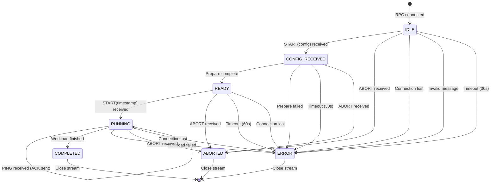

# Agent State Machine - Bidirectional Streaming Protocol

## Overview

The agent implements a robust state machine for the `ExecuteWorkload` RPC with comprehensive error handling, timeout detection, and graceful abort support.

## Agent States

```
┌─────────────────────────────────────────────────────────────────────────┐
│                         AGENT STATE MACHINE                              │
└─────────────────────────────────────────────────────────────────────────┘

States:
  IDLE            - Initial state, waiting for first message
  CONFIG_RECEIVED - Config validated, preparing workload
  READY           - Prepare complete, waiting for start command
  RUNNING         - Workload executing, sending stats every 1s
  COMPLETED       - Workload finished successfully
  ERROR           - Error occurred during execution
  ABORTED         - Gracefully aborted by controller
```

## State Transition Diagram



## Detailed State Transitions

### 1. IDLE State

**Entry**: RPC stream established by controller

**Transitions**:

| Trigger | Validation | Next State | Action | Timeout |
|---------|-----------|------------|--------|---------|
| START(config) | Valid config YAML | CONFIG_RECEIVED | Parse config, start prepare | - |
| START(config) | Invalid config | ERROR | Send error, close stream | - |
| ABORT | - | ABORTED | Send ABORTED status, close | - |
| Connection lost | - | ERROR | Log error, cleanup | - |
| Invalid message | - | ERROR | Send error, close stream | - |
| No message | - | ERROR | Send timeout error | 30s |

**Error Conditions**:
- Config parse failure → ERROR with details
- Unknown message type → ERROR
- Timeout waiting for config → ERROR

---

### 2. CONFIG_RECEIVED State

**Entry**: Config validated, prepare phase starting

**Transitions**:

| Trigger | Validation | Next State | Action | Timeout |
|---------|-----------|------------|--------|---------|
| Prepare complete | Files created | READY | Send READY with timestamp | - |
| Prepare failed | - | ERROR | Send error with details | - |
| ABORT | - | ABORTED | Cancel prepare, cleanup | - |
| Timeout | - | ERROR | Cancel prepare, send error | 30s |

**Prepare Phase Actions**:
1. Create directory tree
2. Generate files with random data
3. Collect prepare metrics (duration, throughput)
4. Send READY with `agent_timestamp_ns` for clock sync

**Error Conditions**:
- Filesystem error → ERROR
- Out of disk space → ERROR
- Permission denied → ERROR
- Timeout (30s) → ERROR

---

### 3. READY State

**Entry**: Prepare complete, waiting for coordinated start

**Transitions**:

| Trigger | Validation | Next State | Action | Timeout |
|---------|-----------|------------|--------|---------|
| START(timestamp) | Valid future timestamp | RUNNING | Wait until timestamp, start workload | - |
| START(timestamp) | Past timestamp | ERROR | Send error "start time in past" | - |
| PING | - | READY | Send ACKNOWLEDGE | - |
| ABORT | - | ABORTED | Cleanup files, send ABORTED | - |
| Timeout | - | ERROR | Send timeout error | 60s |
| Connection lost | - | ERROR | Cleanup, log error | - |

**Coordinated Start Logic**:
1. Receive `coordinated_start_time_ns` (Unix timestamp in nanoseconds)
2. Calculate wait duration: `start_time - SystemTime::now()`
3. If negative → ERROR (start time in past)
4. If > 300s → ERROR (start time too far in future)
5. Sleep until start time (to millisecond precision)
6. Transition to RUNNING
7. Send first RUNNING stats

**Error Conditions**:
- Start time in past → ERROR
- Start time > 5 minutes future → ERROR
- Timeout (60s) waiting for start → ERROR
- Connection lost → ERROR

---

### 4. RUNNING State

**Entry**: Workload executing

**Transitions**:

| Trigger | Validation | Next State | Action | Timeout |
|---------|-----------|------------|--------|---------|
| Workload finished | Success | COMPLETED | Send final stats with status=4 | - |
| Workload error | - | ERROR | Send error stats | - |
| PING | - | RUNNING | Send ACKNOWLEDGE, continue | - |
| ABORT | - | ABORTED | Cancel workload, send ABORTED | - |
| Connection lost | - | ERROR | Cancel workload, cleanup | - |

**Stats Sending Loop** (every 1 second):
1. Check if workload finished
2. Collect current metrics (operations, throughput, errors)
3. Send LiveStats with status=2 (RUNNING)
4. Check for ABORT/PING from controller
5. Sleep 1s, repeat

**PING/PONG Protocol**:
- Controller sends PING if no stats received for 10s
- Agent responds with ACKNOWLEDGE
- If no ACKNOWLEDGE within 5s → connection lost (ERROR)

**Error Conditions**:
- I/O error during workload → ERROR
- Out of disk space → ERROR
- Connection lost → ERROR

---

### 5. COMPLETED State

**Entry**: Workload finished successfully

**Actions**:
1. Send final LiveStats with status=4 (COMPLETED)
2. Wait for controller acknowledgment (optional)
3. Close stream
4. Cleanup resources

**No further transitions** - terminal state

---

### 6. ERROR State

**Entry**: Error occurred at any stage

**Actions**:
1. Log error details
2. Send LiveStats with status=3 (ERROR) and error_message
3. Cancel any running tasks (prepare, workload)
4. Cleanup partial files
5. Close stream
6. Release resources

**No further transitions** - terminal state

---

### 7. ABORTED State

**Entry**: Controller sent ABORT command

**Actions**:
1. Log abort reason (from ABORT message)
2. Send LiveStats with status=5 (ABORTED)
3. Cancel prepare/workload gracefully
4. Cleanup files (optional - based on config)
5. Close stream
6. Release resources

**No further transitions** - terminal state

---

## Timeout Configuration

| Phase | Timeout | Reason |
|-------|---------|--------|
| IDLE → CONFIG_RECEIVED | 30s | Controller must send config promptly |
| CONFIG_RECEIVED → READY | 30s | Prepare shouldn't hang indefinitely |
| READY → RUNNING | 60s | Allow time for distributed coordination |
| RUNNING stats interval | 1s | Regular progress updates |
| PING response | 5s | Detect dead connections quickly |
| Connection keepalive | 10s | Controller sends PING if no stats |

---

## Error Recovery

### Recoverable Errors (Stay in current state)
- None - all errors transition to ERROR state

### Fatal Errors (Immediate ERROR state)
- Config parse failure
- Filesystem errors (permission, space)
- Invalid timestamps
- Protocol violations (wrong message order)
- Connection lost

### Graceful Abort (ABORTED state)
- Controller sends ABORT
- User cancels controller (Ctrl-C) → controller sends ABORT to all
- No retries - abort is final

---

## Implementation Notes

### Shared State Between Tasks

```rust
struct AgentState {
    status: Arc<Mutex<Status>>,           // Current state
    error_message: Arc<Mutex<Option<String>>>, // Error details
    should_abort: Arc<AtomicBool>,        // Abort signal
    start_time_ns: Arc<Mutex<Option<u64>>>, // Coordinated start time
}
```

### Task Structure

```
execute_workload()
├── Control Reader Task
│   ├── Receives: ControlMessage (START, ABORT, PING)
│   ├── Updates: shared state
│   └── Signals: stats writer via state changes
│
└── Stats Writer Task
    ├── Monitors: shared state
    ├── Sends: READY → RUNNING stats → COMPLETED
    └── Responds to: abort signals
```

### Critical Sections

1. **State transitions** - Must be atomic:
   ```rust
   let mut status = self.status.lock().unwrap();
   if *status == Status::Ready {
       *status = Status::Running;
       // Send RUNNING stats
   }
   ```

2. **Abort handling** - Check before expensive operations:
   ```rust
   if self.should_abort.load(Ordering::Relaxed) {
       return Err("Aborted by controller");
   }
   ```

3. **Timeout detection** - Use `tokio::time::timeout()`:
   ```rust
   match timeout(Duration::from_secs(30), prepare()).await {
       Ok(Ok(())) => // Success
       Ok(Err(e)) => // Prepare failed
       Err(_) => // Timeout
   }
   ```

---

## Testing Scenarios

1. **Happy Path**: IDLE → CONFIG_RECEIVED → READY → RUNNING → COMPLETED
2. **Prepare Timeout**: IDLE → CONFIG_RECEIVED → [30s] → ERROR
3. **Invalid Config**: IDLE → [bad config] → ERROR
4. **Abort During Prepare**: IDLE → CONFIG_RECEIVED → [ABORT] → ABORTED
5. **Abort During Workload**: RUNNING → [ABORT] → ABORTED
6. **Start Time in Past**: READY → [START(old timestamp)] → ERROR
7. **Connection Lost**: RUNNING → [disconnect] → ERROR
8. **PING/PONG**: RUNNING → [PING] → [ACKNOWLEDGE] → RUNNING
9. **Workload Error**: RUNNING → [I/O error] → ERROR
10. **Ready Timeout**: READY → [60s no START] → ERROR

---

## Protocol Message Sequence

### Successful Execution

```
Controller → Agent: START(config)
Agent → Controller: (processing...)
Agent → Controller: READY (status=1, agent_timestamp_ns=T)
Controller → Agent: START(coordinated_start_time_ns=T+10s)
Agent: (waits until T+10s)
Agent → Controller: RUNNING (status=2, sequence=1)
Agent → Controller: RUNNING (status=2, sequence=2) [1s later]
Agent → Controller: RUNNING (status=2, sequence=3) [1s later]
...
Agent → Controller: COMPLETED (status=4, final stats)
```

### Abort During Workload

```
Controller → Agent: START(config)
Agent → Controller: READY (status=1)
Controller → Agent: START(timestamp)
Agent → Controller: RUNNING (status=2, sequence=1)
Agent → Controller: RUNNING (status=2, sequence=2)
Controller → Agent: ABORT(reason="User cancelled")
Agent: (cancels workload)
Agent → Controller: ABORTED (status=5)
```

### Prepare Timeout

```
Controller → Agent: START(config)
Agent: (prepare phase hangs)
[30 seconds pass]
Agent → Controller: ERROR (status=3, error_message="Prepare timeout")
```

---

## Metrics and Observability

### Log Events
- State transitions (INFO level)
- Message received/sent (DEBUG level)
- Errors and timeouts (ERROR level)
- Abort signals (WARN level)

### Metrics to Track
- State duration (how long in each state)
- Prepare phase duration
- Wait time until coordinated start
- Workload execution time
- Error counts by type
- Abort counts

### Debug Information
- Last message received timestamp
- Last stats sent timestamp
- Current sequence number
- Abort reason
- Error stack traces
