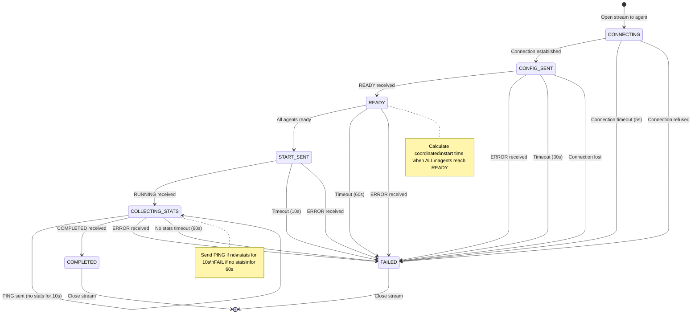
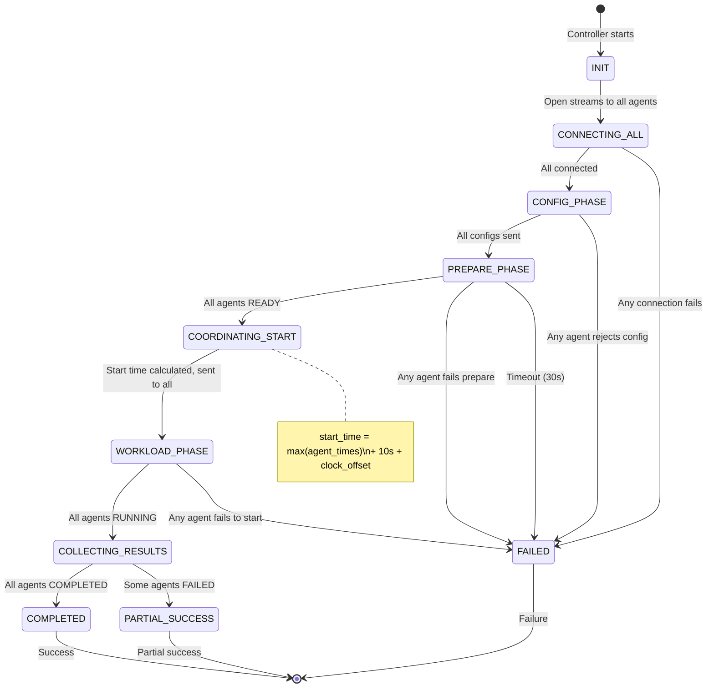

# Controller State Machine - Bidirectional Streaming Protocol

## Overview

The controller orchestrates multiple agents through a robust state machine with per-agent state tracking, timeout management, retry logic, and graceful degradation when some agents fail.

## Controller States (Per Agent)

```
┌─────────────────────────────────────────────────────────────────────────┐
│                      CONTROLLER STATE MACHINE                            │
│                      (Per Agent Connection)                              │
└─────────────────────────────────────────────────────────────────────────┘

States:
  CONNECTING       - Establishing gRPC connection
  CONFIG_SENT      - Config sent, waiting for READY
  READY            - Agent ready, calculating start time
  START_SENT       - Start command sent, waiting for RUNNING
  COLLECTING_STATS - Receiving periodic stats from agent
  COMPLETED        - Agent finished successfully
  FAILED           - Agent failed or timed out
```

## State Transition Diagram



## Global Controller States

In addition to per-agent states, the controller maintains a global orchestration state:



## Detailed State Transitions

### 1. CONNECTING State (Per Agent)

**Entry**: Controller starts, initiates connection to agent

**Transitions**:

| Trigger | Next State | Action | Timeout |
|---------|-----------|--------|---------|
| Stream opened | CONFIG_SENT | Send START(config) | - |
| Connection refused | FAILED | Log error, mark agent failed | 5s |
| Connection timeout | FAILED | Log error, mark agent failed | 5s |
| Network error | FAILED | Log error, mark agent failed | 5s |

**Retry Logic**:
- Retry up to 3 times with exponential backoff (1s, 2s, 4s)
- After 3 failures → FAILED
- Log each retry attempt

**Error Conditions**:
- Agent not reachable → FAILED
- Authentication failure → FAILED
- TLS handshake failure → FAILED

---

### 2. CONFIG_SENT State (Per Agent)

**Entry**: Connection established, config YAML sent to agent

**Transitions**:

| Trigger | Validation | Next State | Action | Timeout |
|---------|-----------|------------|--------|---------|
| READY | Valid agent timestamp | READY | Store clock offset | - |
| ERROR | - | FAILED | Log error message | - |
| Timeout | - | FAILED | Send ABORT, mark failed | 30s |
| Connection lost | - | FAILED | Log error, mark failed | - |

**Config Sent Actions**:
1. Send `ControlMessage::START` with full config YAML
2. Start 30s timeout timer for prepare phase
3. Wait for READY response
4. Extract `agent_timestamp_ns` for clock synchronization

**Clock Offset Calculation**:
```
controller_time = SystemTime::now()
agent_time = agent_timestamp_ns (from READY message)
clock_offset = agent_time - controller_time
```

**Error Conditions**:
- Agent sends ERROR → log error_message, FAILED
- Timeout (30s) → prepare phase hung, FAILED
- Connection lost → network issue, FAILED

---

### 3. READY State (Per Agent)

**Entry**: Agent successfully completed prepare phase

**Transitions**:

| Trigger | Condition | Next State | Action | Timeout |
|---------|-----------|------------|--------|---------|
| All agents READY | - | START_SENT | Calculate & send start time | - |
| ERROR | - | FAILED | Log error | - |
| Timeout | - | FAILED | Send ABORT to all | 60s |

**Waiting for All Agents**:
1. Store this agent's READY timestamp and clock offset
2. Check if ALL agents are now READY
3. If yes → calculate coordinated start time
4. If no → wait (with 60s timeout)

**Coordinated Start Calculation** (when all READY):
```
max_agent_time = max(agent_timestamp_ns for all agents)
start_time = max_agent_time + 10_000_000_000  // +10 seconds
```

**Broadcast START**:
- Send `ControlMessage::START` with `coordinated_start_time_ns`
- Same timestamp sent to ALL agents (absolute Unix time)
- No adjustment for clock offsets (agents wait until absolute time)

**Error Conditions**:
- Any agent sends ERROR → abort all agents, FAILED
- Timeout (60s) waiting for all → abort all, FAILED
- User cancels (Ctrl-C) → send ABORT to all, FAILED

---

### 4. START_SENT State (Per Agent)

**Entry**: Coordinated start time sent to agent

**Transitions**:

| Trigger | Validation | Next State | Action | Timeout |
|---------|-----------|------------|--------|---------|
| RUNNING | status=2 | COLLECTING_STATS | Start stats collection | - |
| ERROR | - | FAILED | Log error, continue with others | - |
| Timeout | - | FAILED | Send ABORT, mark failed | 10s |

**Expectations**:
1. Agent waits until coordinated start time
2. Agent begins workload
3. Agent sends first RUNNING stats within 10s

**Error Conditions**:
- Agent sends ERROR → workload failed to start, FAILED
- Timeout (10s) → agent hung, FAILED
- Wrong status code → protocol violation, FAILED

---

### 5. COLLECTING_STATS State (Per Agent)

**Entry**: Agent is running workload, sending periodic stats

**Transitions**:

| Trigger | Validation | Next State | Action | Timeout |
|---------|-----------|------------|--------|---------|
| RUNNING | status=2 | COLLECTING_STATS | Update metrics, display | - |
| COMPLETED | status=4 | COMPLETED | Store final stats | - |
| ERROR | status=3 | FAILED | Log error message | - |
| ABORTED | status=5 | FAILED | Log abort reason | - |
| No stats | - | COLLECTING_STATS | Send PING | 10s |
| Still no stats | - | FAILED | Assume dead | 60s |
| User abort | - | FAILED | Send ABORT | - |

**Stats Processing Loop**:
1. Receive RUNNING stats (every ~1s from agent)
2. Update metrics:
   - Operations completed (by bucket)
   - Throughput (MB/s, ops/s)
   - Latency percentiles (p50, p95, p99)
   - Error counts
3. Update progress display (optional)
4. Check for timeouts

**PING/PONG Protocol**:
- If no stats for 10s → send `ControlMessage::PING`
- If agent responds with ACKNOWLEDGE → continue
- If no response for 5s → repeat PING (up to 3 times)
- If still no response → assume dead, FAILED

**Timeout Detection**:
- No stats for 10s → send PING (first warning)
- No stats for 60s → agent hung, FAILED

**Error Conditions**:
- Agent sends ERROR → workload failed, FAILED
- Agent sends ABORTED → agent aborted, FAILED
- No stats for 60s → assumed dead, FAILED
- Connection lost → network failure, FAILED

---

### 6. COMPLETED State (Per Agent)

**Entry**: Agent successfully finished workload

**Actions**:
1. Store final statistics (status=4)
2. Close stream to agent
3. Mark agent as COMPLETED
4. Check if all agents completed
5. If yes → aggregate results, generate reports

**No further transitions** - terminal state

---

### 7. FAILED State (Per Agent)

**Entry**: Agent failed at any stage

**Actions**:
1. Log failure reason (error message, timeout, connection lost)
2. Send ABORT to agent (if still connected)
3. Close stream
4. Mark agent as FAILED
5. Continue with other agents (graceful degradation)

**Failure Impact**:
- If ANY agent fails during prepare → abort ALL agents
- If agent fails during workload → continue with others
- Final report indicates partial success

**No further transitions** - terminal state

---

## Global Orchestration Logic

### Connection Phase
```
For each agent in config:
  1. Open gRPC stream (5s timeout, 3 retries)
  2. If any connection fails → abort all, exit
  3. Mark agent as CONNECTING → CONFIG_SENT
```

### Config Phase
```
For each connected agent:
  1. Send START(config YAML)
  2. Start 30s timeout timer
  3. Wait for READY response
  4. If any agent times out → abort all, exit
  5. If any agent sends ERROR → abort all, exit
```

### Prepare Phase
```
Wait until all agents send READY:
  1. Collect agent_timestamp_ns from each READY
  2. Calculate clock offsets (for debugging)
  3. If timeout (30s) → abort all, exit
  4. If any ERROR → abort all, exit
```

### Start Coordination
```
When all agents READY:
  1. max_time = max(agent_timestamp_ns for all)
  2. start_time = max_time + 10 seconds
  3. For each agent:
     - Send START(coordinated_start_time_ns = start_time)
  4. Wait for all agents to send RUNNING (10s timeout)
  5. If any timeout → mark FAILED, continue with others
```

### Stats Collection Phase
```
While any agent still running:
  1. Receive stats from all RUNNING agents
  2. Update aggregate metrics every 1s
  3. Display progress (optional)
  4. Send PING if no stats for 10s
  5. Mark FAILED if no stats for 60s
  6. Handle COMPLETED, ERROR, ABORTED messages
  7. Continue until all agents reach terminal state
```

### Results Aggregation
```
After all agents complete or fail:
  1. Close all streams
  2. Aggregate metrics from COMPLETED agents
  3. Generate per-agent TSV files
  4. Generate consolidated TSV with histogram merging
  5. Log summary (X succeeded, Y failed)
  6. Exit with appropriate code (0 if all succeeded)
```

---

## Timeout Configuration

| Phase | Timeout | Retry | Action on Timeout |
|-------|---------|-------|-------------------|
| Connection | 5s | 3x | Abort all if any fails |
| Config → READY | 30s | No | Abort all |
| All agents READY | 60s | No | Abort all |
| START → RUNNING | 10s | No | Mark agent FAILED, continue |
| RUNNING stats | 10s | No | Send PING |
| PING response | 5s | 3x | Mark agent FAILED |
| No stats | 60s | No | Mark agent FAILED |

---

## Error Handling Strategy

### Fatal Errors (Abort All Agents)
- Connection failure during initial connect
- Any agent rejects config (ERROR during prepare)
- Timeout waiting for all agents to be READY
- User cancels (Ctrl-C)

### Recoverable Errors (Continue with Remaining)
- Agent fails to START workload
- Agent fails during RUNNING phase
- Agent times out during stats collection
- Connection lost to agent during workload

### Graceful Degradation
- Continue collecting stats from successful agents
- Report partial success in final summary
- Generate consolidated results from successful agents only
- Exit code indicates partial failure (non-zero)

---

## Retry Logic

### Connection Retries
```
attempts = 0
while attempts < 3:
    try to connect
    if success: break
    backoff = 2^attempts seconds
    sleep(backoff)
    attempts += 1
if failed: mark FAILED
```

### PING Retries
```
ping_attempts = 0
while no stats and ping_attempts < 3:
    send PING
    wait 5s for ACKNOWLEDGE
    if received: continue normal operation
    ping_attempts += 1
if no response: mark FAILED
```

### No Retries For
- Config rejection
- Prepare timeout
- Invalid start time
- Workload errors
- Graceful aborts

---

## Message Sequences

### Successful Distributed Execution (3 Agents)

```
Controller                Agent1                 Agent2                 Agent3
    |                        |                      |                      |
    |---START(config)------->|                      |                      |
    |---START(config)-------------------------------->|                      |
    |---START(config)-------------------------------------------------->|
    |                        |                      |                      |
    |<-------READY-----------|                      |                      |
    |<-------READY-----------------------------------|                      |
    |<-------READY---------------------------------------------------|
    |                        |                      |                      |
    | [Calculate start_time = max(agent_times) + 10s]                     |
    |                        |                      |                      |
    |---START(timestamp)---->|                      |                      |
    |---START(timestamp)-------------------------->|                      |
    |---START(timestamp)---------------------------------------------->|
    |                        |                      |                      |
    |<------RUNNING----------|                      |                      |
    |<------RUNNING-------------------------------------|                      |
    |<------RUNNING-----------------------------------------------------|
    |                        |                      |                      |
    | [All agents start synchronously at timestamp]                        |
    |                        |                      |                      |
    |<------RUNNING----------|                      |                      |
    |<------RUNNING-------------------------------------|                      |
    |<------RUNNING-----------------------------------------------------|
    |                        |                      |                      |
    | [Stats every 1s from each agent]                                     |
    |                        |                      |                      |
    |<----COMPLETED----------|                      |                      |
    |<----COMPLETED-------------------------------------|                      |
    |<----COMPLETED-----------------------------------------------------|
    |                        |                      |                      |
    | [Aggregate results, generate reports]                                |
```

### Agent Failure During Prepare (Abort All)

```
Controller                Agent1                 Agent2
    |                        |                      |
    |---START(config)------->|                      |
    |---START(config)----------------------------->|
    |                        |                      |
    |<-------READY-----------|                      |
    |<-------ERROR-----------------------------|
    |                        |                      |
    |---ABORT--------------->|                      |
    |---ABORT-------------------------------->|
    |                        |                      |
    | [Exit with error]                             |
```

### Agent Failure During Workload (Continue with Others)

```
Controller                Agent1                 Agent2
    |                        |                      |
    |<------RUNNING----------|                      |
    |<------RUNNING------------------------------|
    |                        |                      |
    |<------RUNNING----------|                      |
    |<------ERROR------------------------------|
    |                        |                      |
    | [Agent2 marked FAILED, continue with Agent1]  |
    |                        |                      |
    |<------RUNNING----------|                      |
    |<----COMPLETED----------|                      |
    |                        |                      |
    | [Report: 1 succeeded, 1 failed]               |
```

### PING/PONG on Timeout

```
Controller                Agent1
    |                        |
    |<------RUNNING----------|
    |                        |
    | [10s with no stats]    |
    |                        |
    |-------PING------------>|
    |<---ACKNOWLEDGE---------|
    |                        |
    |<------RUNNING----------|
    | [Normal operation resumes]
```

### User Abort (Ctrl-C)

```
Controller                Agent1                 Agent2
    |                        |                      |
    |<------RUNNING----------|                      |
    |<------RUNNING------------------------------|
    |                        |                      |
    | [User presses Ctrl-C]                         |
    |                        |                      |
    |---ABORT--------------->|                      |
    |---ABORT-------------------------------->|
    |                        |                      |
    |<-----ABORTED-----------|                      |
    |<-----ABORTED-------------------------------|
    |                        |                      |
    | [Exit gracefully]                             |
```

---

## Implementation Notes

### Per-Agent State Tracking

```rust
struct AgentConnection {
    agent_id: String,
    address: String,
    state: AgentState,
    stream: Option<BiStream>,
    last_stats: Option<LiveStats>,
    last_message_time: Instant,
    clock_offset_ns: i64,
    error_message: Option<String>,
}

enum AgentState {
    Connecting,
    ConfigSent,
    Ready,
    StartSent,
    CollectingStats,
    Completed,
    Failed,
}
```

### Global Controller State

```rust
struct ControllerState {
    agents: Vec<AgentConnection>,
    phase: GlobalPhase,
    start_time_ns: Option<u64>,
    results_dir: PathBuf,
    abort_signal: Arc<AtomicBool>,
}

enum GlobalPhase {
    Init,
    ConnectingAll,
    ConfigPhase,
    PreparePhase,
    CoordinatingStart,
    WorkloadPhase,
    CollectingResults,
    Completed,
    Failed,
}
```

### Async Task Structure

```
main()
├── Create agent connections
├── Spawn per-agent stream handlers
│   ├── Connection task (CONNECTING → CONFIG_SENT)
│   ├── Config sender task (CONFIG_SENT → READY)
│   ├── Stats receiver task (COLLECTING_STATS → COMPLETED)
│   └── Timeout monitor task (checks deadlines)
├── Orchestration loop
│   ├── Wait for all READY
│   ├── Calculate & send start time
│   ├── Collect stats from all agents
│   └── Aggregate results
└── Cleanup on exit
```

### Ctrl-C Handling

```rust
tokio::spawn(async move {
    tokio::signal::ctrl_c().await.unwrap();
    abort_signal.store(true, Ordering::Relaxed);
    // Send ABORT to all agents
    for agent in agents {
        let _ = agent.send_abort("User cancelled").await;
    }
});
```

---

## Testing Scenarios

1. **All agents succeed**: COMPLETED with full results
2. **One agent fails prepare**: Abort all, no results
3. **One agent fails workload**: Continue with others, partial results
4. **Connection timeout**: Retry 3x, then fail
5. **PING/PONG timeout**: Send PING, wait for ACK
6. **User abort (Ctrl-C)**: Send ABORT to all, graceful exit
7. **Agent hangs (60s no stats)**: Mark FAILED, continue with others
8. **Network partition**: Connection lost, mark FAILED
9. **Clock skew (±10s)**: All agents start synchronously
10. **Config rejection**: Agent ERROR → abort all

---

## Metrics and Observability

### Controller Logs
- Agent state transitions (INFO)
- Messages sent/received per agent (DEBUG)
- Timeout events (WARN)
- Errors and failures (ERROR)
- Aggregate progress every 5s (INFO)

### Metrics to Track
- Per-agent state durations
- Total prepare time (slowest agent)
- Coordinated start accuracy (did they all start within 1s?)
- Stats collection rate (stats/sec per agent)
- Failure counts by phase
- PING/PONG counts

### Debug Information
- Clock offsets per agent
- Last message timestamp per agent
- Retry counts per agent
- Connection durations
- Full message history (DEBUG mode)

---

## Exit Codes

| Exit Code | Meaning |
|-----------|---------|
| 0 | All agents completed successfully |
| 1 | All agents failed |
| 2 | Partial success (some agents failed) |
| 3 | User abort (Ctrl-C) |
| 4 | Connection failure |
| 5 | Config rejected by agent |
| 6 | Timeout during prepare |
